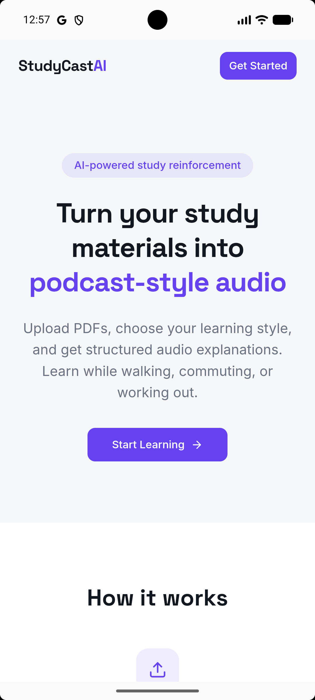
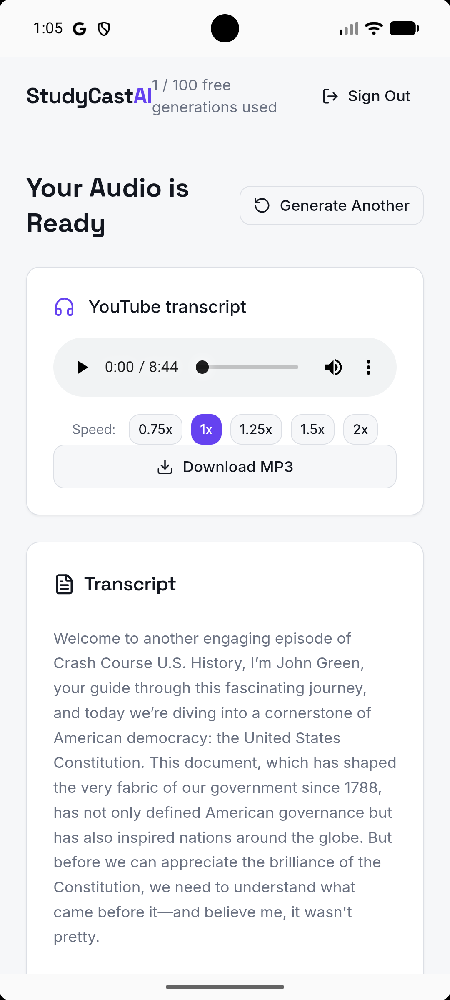
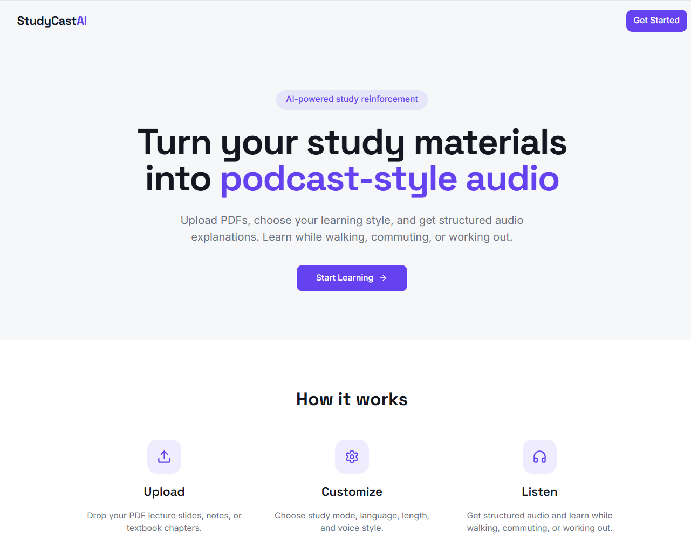
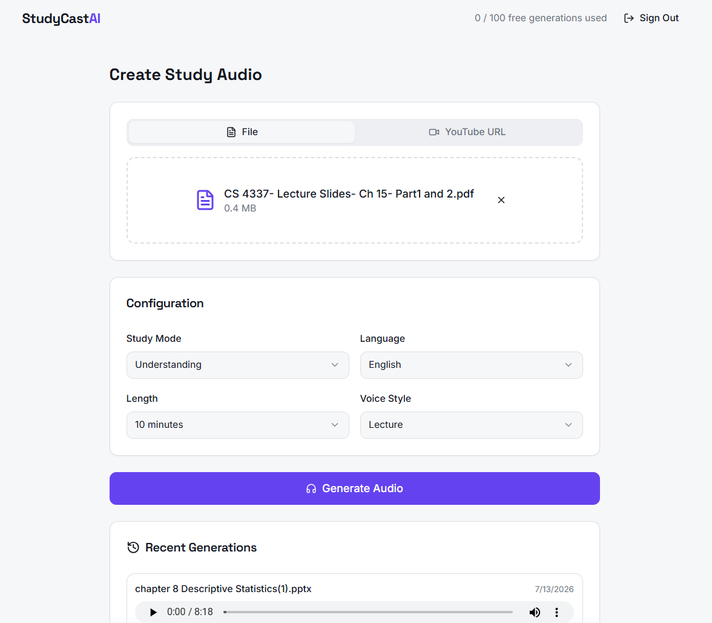
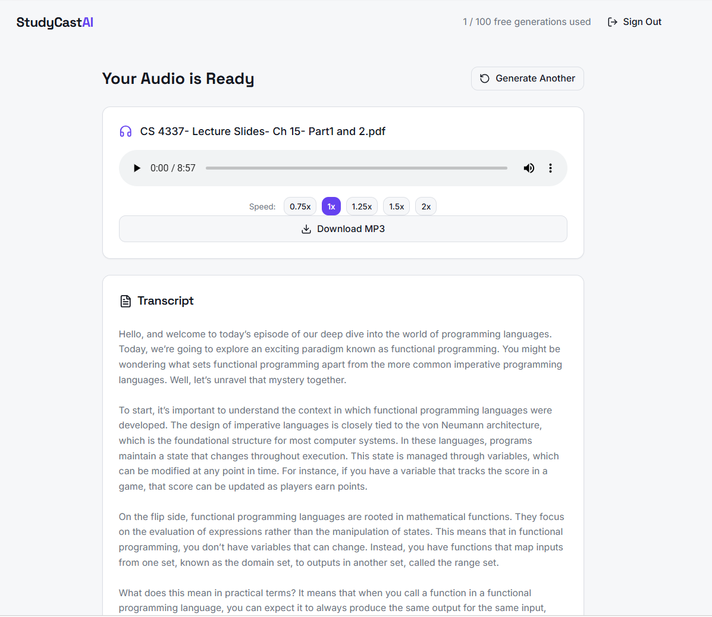

<div align="center">

# 🎧 StudyCast AI

**Turn any study material into an AI-narrated podcast — then ask it questions.**

StudyCast AI converts PDFs, slide decks, lecture videos, and YouTube URLs into podcast-style audio lessons, and layers a Retrieval-Augmented Generation (RAG) Q&A system on top so you can query your own material by voice or text. Built end-to-end — auth, async processing pipeline, vector search, cloud deployment, and a native Android app — as a full-stack systems project, not a wrapper around one API call.

[](https://studycast-livid.vercel.app)
[](LICENSE)
[](package.json)
[](package.json)
[](backend/package.json)
[](#tech-stack)
[](#tech-stack)

</div>

<br/>

## Screenshots

<table>
<tr>
<td width="45%"></td>
<td width="55%" valign="middle">

**Landing — mobile**

The landing screen leads with the core pitch — turning study material into podcast-style audio — behind a single primary action. Built mobile-first, since the actual use case (listening while walking, commuting, or at the gym) happens on a phone, not a desktop.

</td>
</tr>
<tr>
<td width="45%"></td>
<td width="55%" valign="middle">

**Audio ready — mobile**

Once a job finishes, the player, playback-speed control, and MP3 download are available immediately, with the full transcript scrollable underneath. This particular result was generated directly from a YouTube URL — no PDF involved.

</td>
</tr>
<tr>
<td width="45%"></td>
<td width="55%" valign="middle">

**Landing — desktop**

The desktop view adds the three-step flow — Upload, Customize, Listen — so the product is legible from a single screenshot, not just after clicking around.

</td>
</tr>
<tr>
<td width="45%"></td>
<td width="55%" valign="middle">

**Create Study Audio**

This is where a job actually gets configured: source file, study mode (e.g. Understanding vs. exam prep), language, target length, and voice style — all of which feed the worker pipeline's script-generation prompt. Past generations are listed below for quick re-access.

</td>
</tr>
<tr>
<td width="45%"></td>
<td width="55%" valign="middle">

**Audio + transcript — desktop**

The result view pairs the generated audio — with speed control and MP3 download — against the full transcript below it, so narration can be checked against the source material at a glance.

</td>
</tr>
</table>

<br/>

## Why this exists

Studying from dense PDFs and hour-long lecture videos doesn't fit into a commute or a gym session. StudyCast AI turns that material into audio you can actually listen to, and — because a summary always leaves things out — lets you ask the source document follow-up questions directly, with answers grounded only in that document (not the model's general knowledge).

## How it works

```
Upload (PDF / PPTX / Video / YouTube URL)
        │
        ▼
   Presigned S3 upload
        │
        ▼
  Job enqueued (BullMQ + Redis) ──► API returns immediately, job runs in background
        │
        ▼
┌─────────────────────────────────────────────┐
│               Worker pipeline                │
│  1. Extract text  (Gemini · Whisper ASR)     │
│  2. Chunk + embed (OpenAI embeddings)        │
│  3. Store vectors (Postgres + pgvector)      │
│  4. Generate script (GPT-4o-mini)            │
│  5. Synthesize audio (OpenAI TTS)            │
│  6. Upload result to S3                      │
└─────────────────────────────────────────────┘
        │
        ▼
  Audio lesson ready  +  document is now queryable via RAG
        │
        ▼
  "Ask" endpoint → cosine similarity search (HNSW index) → top-k chunks
        → relevance-thresholded → answer generated only from retrieved context
```

The upload request returns instantly; a worker processes the job asynchronously and the frontend polls job status. If a question falls below a calibrated relevance threshold, the system says so instead of guessing.

## Highlights

- **Async by design.** File processing runs on a BullMQ/Redis job queue instead of blocking the request thread — the API responds immediately and the client polls for progress, which is what actually happens in production systems handling slow AI calls (transcription, embedding, TTS can take minutes).
- **RAG that refuses to guess.** Retrieval uses pgvector's cosine distance operator over an HNSW index. Answers are generated *only* from retrieved chunks, and a relevance threshold (calibrated against real test queries, not a default) causes the system to say "not covered by this document" rather than hallucinate.
- **Multi-modal ingestion.** PDFs and slides go through Gemini for extraction; lecture videos are transcribed with Whisper; YouTube links pull transcripts directly — three different input paths converging into one pipeline.
- **Tested where it matters.** The AI pipeline (extraction, script generation, TTS) is tested with mocked provider calls so tests are fast and deterministic; CI runs migrations and the full test suite against a real `pgvector/pgvector` Postgres service container, not a mocked database.
- **Shipped, not just deployed.** Live on Railway (API + worker) and Vercel (frontend), with a signed release build in Google Play closed testing — the full path from `git push` to an installable Android app.

## Tech Stack

| Layer | Technology |
|---|---|
| **Frontend** | React, TypeScript, Vite, Tailwind CSS, shadcn/ui, TanStack Query |
| **Backend** | Node.js, Express, TypeScript |
| **Database** | PostgreSQL (Neon) with `pgvector` + HNSW indexing |
| **Queue / Cache** | Redis, BullMQ |
| **AI / ML** | Google Gemini, OpenAI Whisper (ASR), GPT-4o-mini, OpenAI TTS, OpenAI Embeddings |
| **Storage** | AWS S3 (presigned URLs) |
| **Mobile** | Capacitor (Android), published to Google Play |
| **Infra** | Docker, Railway, Vercel, GitHub Actions CI |
| **Observability** | Sentry, Pino structured logging |
| **Testing** | Vitest, mocked AI provider calls, CI-integrated Postgres service container |

## Engineering decisions worth knowing about

- **Why a job queue instead of synchronous processing:** the original design awaited each pipeline step in the request handler. Under real load — a 30-second Whisper transcription plus TTS generation — that meant timeouts and no way to show progress. Moving to BullMQ decoupled request handling from processing and made the pipeline resumable and retryable.
- **Why pgvector over a dedicated vector DB:** the data already lives in Postgres (users, uploads, jobs); adding vectors as a column with an HNSW index avoided a second database, a second connection pool, and a second place for data to get out of sync — at the cost of some raw ANN throughput this project doesn't need at its scale.
- **Why the relevance threshold is a measured constant, not a guess:** early testing showed the RAG system would confidently answer questions the source document didn't actually cover. The 0.2 cosine-distance cutoff was tuned against real retrieval results, not picked arbitrarily.

## Getting Started

```bash
git clone https://github.com/jieCheong/studycast.git
cd studycast

# Start Postgres (pgvector) + Redis
docker compose up -d postgres redis

# Backend
cd backend
npm install
cp .env.example .env        # fill in DB, Redis, AWS, and AI provider keys
npm run migrate:up
npm run dev                 # API on :3001
npm run worker              # in a second terminal — processes queued jobs

# Frontend
cd ..
npm install
npm run dev                 # app on :5173
```

### Testing

```bash
cd backend && npm test      # pipeline, auth, jobs, rate-limiting — AI calls are mocked
cd .. && npm test            # frontend unit tests
```

CI runs the same suite against a live `pgvector/pgvector:pg16` container on every push — see [`.github/workflows/ci.yml`](.github/workflows/ci.yml).

## Roadmap

- [ ] Google Play production rollout, following closed testing
- [ ] Payment tier for usage beyond the free-generation limit

## License

MIT — see [LICENSE](LICENSE).

---

<div align="center">

Built by [**jieCheong**](https://github.com/jieCheong)

</div>
